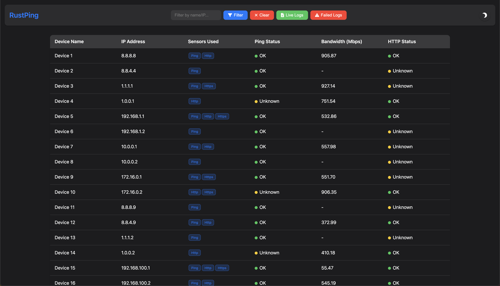
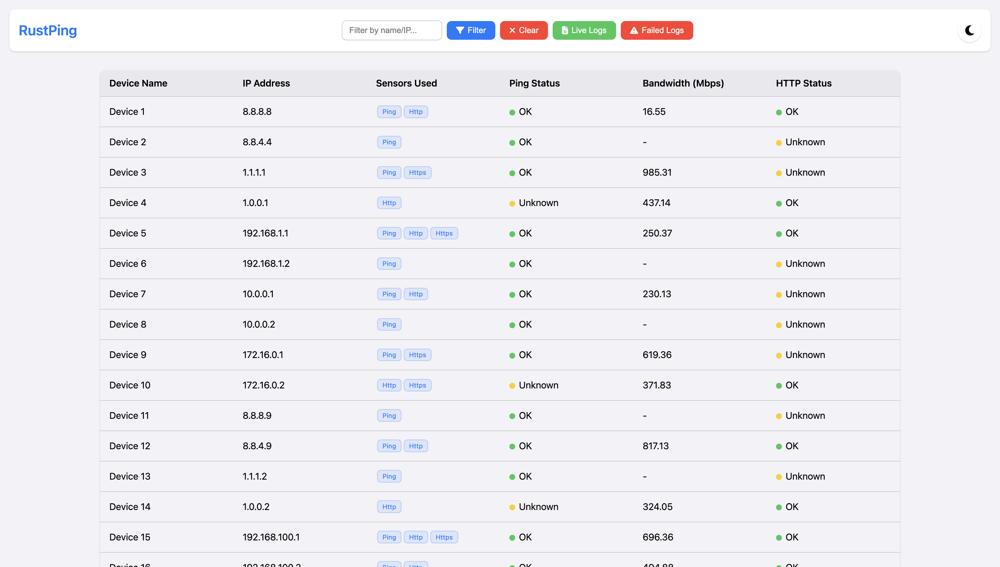
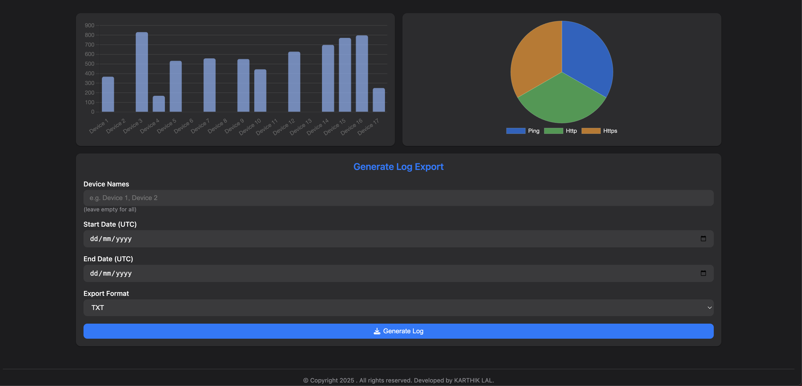
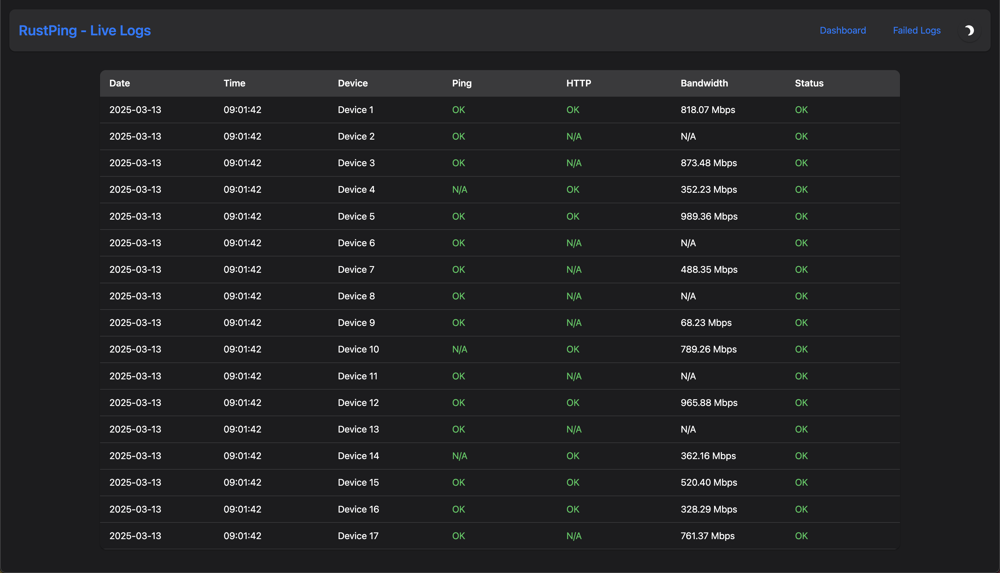
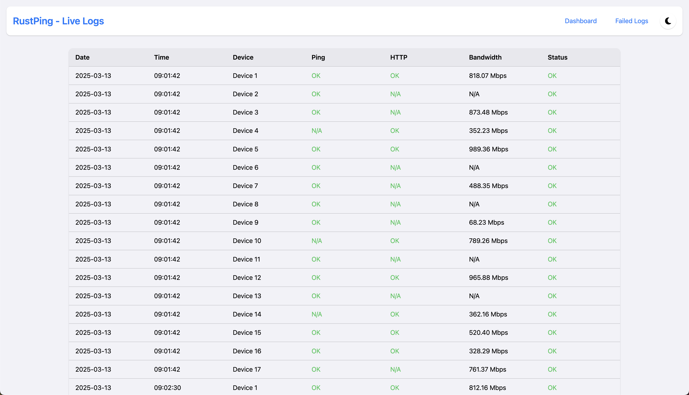
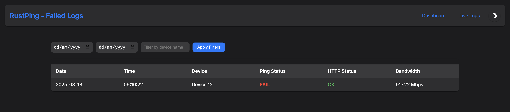
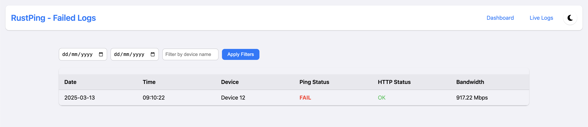

# RustPing

A robust network monitoring tool built with Rust and Rocket framework that provides real-time monitoring of network devices through ping, HTTP checks, and bandwidth monitoring.

## Features

- 🔍 Real-time device monitoring
- 📊 Interactive dashboard with charts
- 🌐 Multiple sensor support (Ping, HTTP, Bandwidth)
- 📝 Detailed logging system
- 🔄 Automatic retry mechanism for failed pings
- 📈 Visual status indicators
- 🌙 Dark/Light mode support
- 📅 Export logs to CSV/TXT format
- <b>Upcoming: New sensors (TCP, UDP, etc.) 🔴
- Upcoming: Email/SMS notifications for device status changes 🔴
- Upcoming: User authentication and role-based access control 🔴
- Upcoming: Docker support for easy deployment 🔴
- Upcoming: Mobile app for remote monitoring 🔴</b>

## Screenshots
<!-- Add as table -->
| Dark Mode | Light Mode |
|------------|-----------|
|  |  |
|  |  |
|  |  | |  |  |
|  |  |

## Table of Contents
- [Prerequisites](#prerequisites)
- [Installation](#installation)
- [Configuration](#configuration)
- [Usage](#usage)
- [API Endpoints](#api-endpoints)
- [Contributing](#contributing)
- [License](#license)

## Prerequisites

- Rust 1.56 or higher
- Cargo package manager
- Network access for monitoring devices

## Installation (Linux/MacOS)

1. Clone the repository:
```sh
git clone https://github.com/karthik558/Rust-Ping.git &&
cd Rust-Ping
```
2. Build the project:
```sh
cargo build --release
```
3. Run the application:
```sh
cargo run
```
4. Open your web browser and navigate to `http://127.0.0.1:8000/static/index.html` to access the dashboard.

## Installation (Windows)
1. Clone the repository:
```sh
git clone https://github.com/karthik558/Rust-Ping.git &&
cd Rust-Ping
```
2. MinGW-w64 or MSYS2 should be installed. Follow the instructions on the [MSYS2 website](https://www.msys2.org/) to install it.

3. If you have not installed Rust, follow the instructions on the [Rust website](https://www.rust-lang.org/tools/install) to install it.

4. If msys2 is not working, you can download the [MinGW-w64 installer](https://github.com/Vuniverse0/mingwInstaller/releases/download/1.2.1/mingwInstaller.exe) and install it.

5. Download and install it and make sure to add the path to the `bin` folder of MinGW-w64 to your system's PATH environment variable. The path should look something like this:
```
C:\Program Files\mingw-w64\x86_64-8.1.0-posix-seh-rt_v6-rev0\mingw64\bin
```

6. Make sure ```
rustup default stable-x86_64-pc-windows-gnu``` is set. You can check this by running:
```sh
rustup show
```
7. Open a new command prompt and navigate to the project directory:
```sh
cd Rust-Ping
```
8. Build the project:
```sh
cargo build --release
```
9. Run the application:
```sh
cargo run
```
10. Open your web browser and navigate to `http://127.0.0.1:8000/` to access the dashboard.


## Configuration
Create/edit the `devices.json` file in the root directory to add or modify devices to be monitored. The configuration file should be in JSON format and include the following fields:

```json
[
  {
    "name": "Router",
    "ip": "192.168.1.1",
    "sensors": ["Ping", "Http"],
    "http_path": "http://192.168.1.1"
  },
  {
    "name": "NAS",
    "ip": "192.168.1.2",
    "sensors": ["Ping"]
  }
]
```

## Usage
1. Access the dashboard at `http://127.0.0.1:8000/`
2. Add devices to monitor by editing the `devices.json` file.
3. The dashboard will automatically refresh every 5 seconds to display the latest status of the devices.
4. Click on the device name to view detailed logs and sensor data.
5. Export logs to CSV/TXT format for further analysis.

## API Endpoints
- `GET / - Dashboard Interface`
- `GET /api/devices - List all devices`
- `POST /api/devices - Add a new device`
- `GET /export_log - Export monitoring logs`
- `GET /log_json - Get logs in JSON format`
- `GET /failed_log - Get failed logs`

## Contributing
Contributions are welcome! Please feel free to submit a Pull Request.

## License
This project is licensed under the MIT License. See the [LICENSE](LICENSE) file for details.